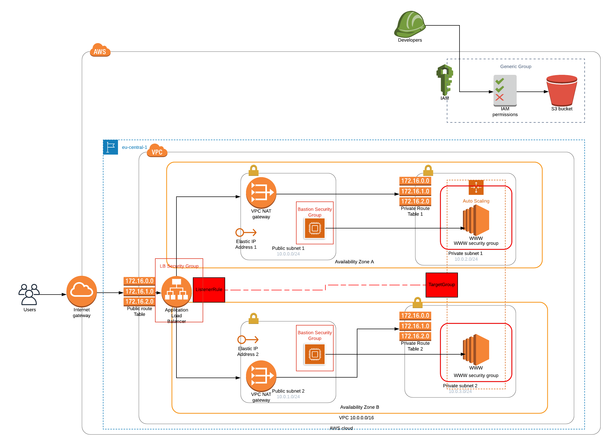

# Deploy a high-availability web app
This project deploys servers for a high-availability web app called Udagram.
The project covers all aspects of creating IaC. It contains a diagram of how
the infrastructure will look like and the automated scripts needed to launch
it on AWS. This production build is using us-west-2 as a region.

## Requirements
1. You need to have aws cli installed in order to run the necessary scripts:
   ```
    curl "https://awscli.amazonaws.com/awscli-exe-linux-x86_64zip" -o "awscliv2.zip"
    unzip awscliv2.zip
    sudo ./aws/install
2. Check that the installation is complete:
    ```
    aws s3 ls (if no errors occur we are good to GO)

## Specifications
1. Server specs: 2 vCPUs, 4GB RAM and 10GB of disk space.
2. Use Linux for the instances operating system.
3. A load balancer for the server, which has an auto-scaling capability span over two AZs.
4. Utilized private subnets used for the WWW instances, which can be accessed from a bastion host and the LB.
5. Security groups have been deployed for the WWW instances, bastion hosts and LB. 
6. The WWW use NAT Gateways for outbound traffic.
7. S3 buckets are used for the WWW source code, as well as the .pem file for the bastion hosts
8. IAM instances are provided for both buckets.
9. Health checks are employed to help monitor system behaviour.
10. Create/Update/Delete scripts are provided as well.
11. Here is the diagram of the actual design:


## How to use
1. Create a key-pair for you bastion hosts. This can be done from the EC2 Dashboard in your AWS Console. For security reasons create an S3 bucket for this key as well. Use the following bucket policy (replace YOUR-BUCKET!): 
    ```
    {
        "Version": "2012-10-17",
        "Id": "Policy1564815775429",
        "Statement": [
            {
                "Sid": "Stmt1564815768845",
                "Effect": "Allow",
                "Principal": {
                    "Service": "ec2.amazonaws.com"
                },
                "Action": "s3:ListBucket",
                "Resource": "arn:aws:s3:::YOUR-BUCKET"
            }
        ]
    }
2. When done with the previous task substitute `BastionHostSSHS3Bucket` and `BastionHostSSHKeyName` in `app-bastion-params.json` with your corresponding bucket and key-pair.
3. Now, create a bucket for Udagrams static files. Use the same policy as stated in 1. and upload the .zip file provided in this stack. When done substitute `AppS3Bucket` in the app-servers-params.json file
4. From here on, we need to create the actual stacks. Each step needs to be completed before moving to the next one (Check your AWS console to see how the stacks are being deployed). We start with the infrastrucutre first:
    ```
    ./create.sh aws-infra app-infrastructure.yml app-infrastructure-params.json

5. Then we create the bastion hosts:
    ```
    ./create.sh aws-bastions app-bastion.yml app-bastion-params.json

6. Finally, run:
    ```
    ./create.sh aws-severs app-servers.yml app-servers-params.json
7. If everything went smooth, you can check your aws-servers stack's output, which will be the LB DNS, and it should take you to Udagrams front page.
8. An update stack script is provided, which is used in the same fashion as the create one. A delete stack script is also provided:
    ```
    ./delete.sh stack-name